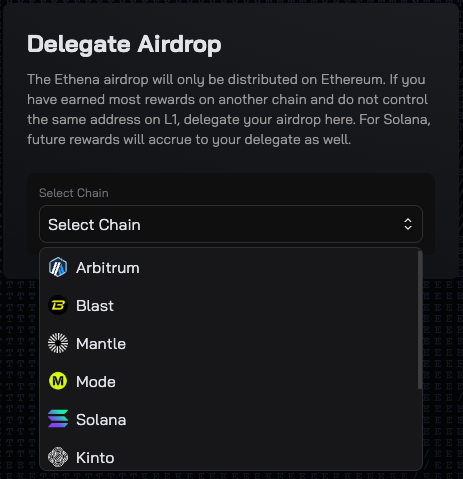
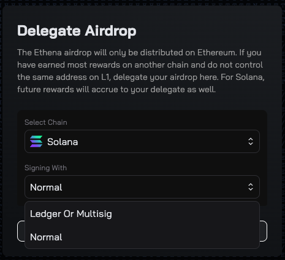

# Overview

This repo offers a self service approach to Ethena Points Campaign integrations.

# Instructions

For your protocol to be included and your users to receive points, you should submit a PR to this repo. Here some guidelines to follow:

1. Make a copy of `.env.example` and name it `.env`.
2. Run `pip install -r requirements.txt` to install the required packages.
3. Add your integration metadata to `integrations/integration_ids.py`.
4. Create a new summary column in `constants/summary_columns.py`.
5. Choose your integration type:
   - For EVM compatible chains: Copy [CachedBalancesTemplate](integrations/template.py)
   - For non-EVM chains (e.g. Solana): Copy [L2DelegationTemplate](integrations/l2_delegation_template.py)
     - We strongly recommend using a TypeScript script or similar to fetch balances for better reliability and maintainability
     - See [KaminoL2DelegationExampleIntegration](integrations/kamino_l2_delegation_example_integration.py) for the recommended TypeScript approach
       - Create your TypeScript script in the `ts/` directory
       - Use the Kamino example as a reference for calling your script from Python
     - API integration is also supported but less preferred (see [RatexL2DelegationExampleIntegration](integrations/ratex_l2_delegation_example_integration.py))
6. Name your file `[protocol name]_integration.py` and place it in the `integrations` directory.
7. Your integration must inherit from either:
   - `CachedBalancesIntegration` and implement the `get_block_balances` method
   - `L2DelegationIntegration` and implement the `get_l2_block_balances` and `get_participants_data` methods
8. The integration should return user balances:
   - For CachedBalances: Return a dict of {block_number: {checksum_address: balance}}
   - For L2Delegation: Return a dict of {block_number: {address: balance}}
9. Write some basic tests at the bottom of the file to ensure your integration is working correctly.
10. Submit a PR to this repo with your integration and ping the Ethena team in Telegram.

# Guidelines

- Integrations must follow this architecture and be written in python.
- The `get_block_balances` method should be as efficient as possible. So the use of the cached data from previous blocks if possible is highly encouraged.
- We prefer that on chain RPC calls are used to get information as much as possible due to reliability and trustlessness. Off chain calls to apis or subgraphs are acceptable if necessary. If usage is not reasonable or the external service is not reliable, users may not receive their points.

# L2 Delegation Setup Requirements

For non-EVM chain integrations (like Solana), your users must complete an additional delegation step to receive points. This process links their L2 wallet to their Ethereum address:

1. Visit the [Ethena UI](https://app.ethena.fi) and connect your Ethereum wallet
2. Navigate to "[Ethena Delegation Section](https://app.ethena.fi/delegation)"
3. Click "Select Chain" and select.

4. Click "Signing With" and select your wallet type.

5. Connect your wallet and sign a message to prove ownership
6. Once delegated, your L2 balances will be attributed to your Ethereum address for points calculation

**Important Notes:**
- Users must complete this delegation in order for their L2 balances to count towards points, they can delegate at any moment and they won't miss any past points.

# Examples
## Cached Balances Integrations (Default)
- [ClaimedEnaIntegration](integrations/claimed_ena_example_integration.py): This integration demonstrates how to track ENA token claims using cached balance 
snapshots for improved performance. It reads from previous balance snapshots to efficiently track user claim history.
- [BeefyCachedBalanceExampleIntegration](integrations/beefy_cached_balance_example_integration.py): This integration is an example of a cached balance integration 
that is based on API calls.

## L2 Delegation Examples (For non-EVM chains)
- [KaminoL2DelegationExampleIntegration](integrations/kamino_l2_delegation_example_integration.py)
  - Example of L2 delegation for Solana chain
  - Uses TypeScript script to query Kamino balances
  - Demonstrates cross-chain integration pattern

- [RatexL2DelegationExampleIntegration](integrations/ratex_l2_delegation_example_integration.py)
  - Example of L2 delegation using API calls
  - Shows how to integrate external API data sources
  - Demonstrates proper API response handling

## Legacy Integrations (Don't use, just for reference)
- [PendleLPTIntegration](integrations/pendle_lpt_integration.py): (Legacy Example) A basic integration showing Pendle LPT staking tracking. Note: This is a 
non-cached implementation included only for reference - new integrations should use the cached approach for better efficiency.
- [PendleYTIntegration](integrations/pendle_yt_integration.py): (Legacy Example) A basic integration showing Pendle YT staking tracking. Note: This is a non-cached 
implementation included only for reference - new integrations should use the cached approach for better efficiency.
